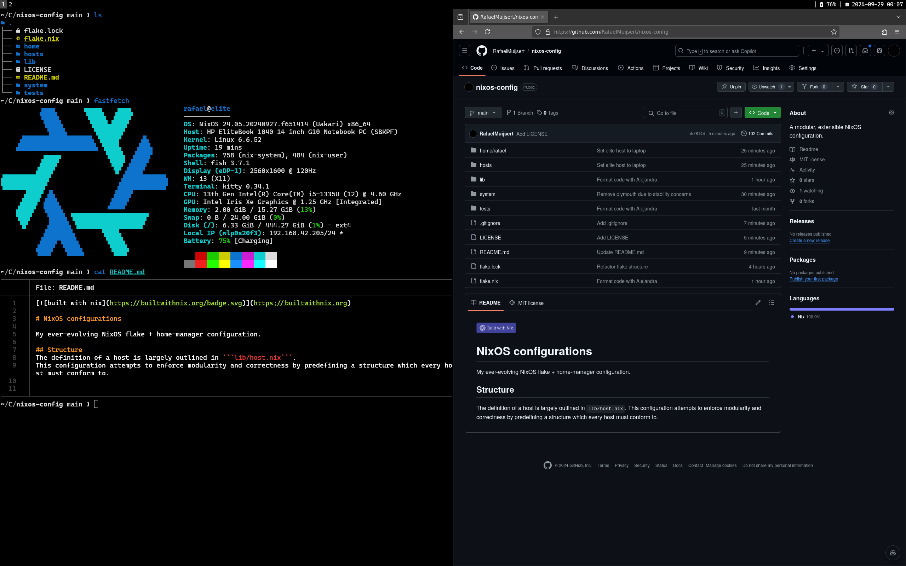

<h1 align="center">:snowflake: Rafael's NixOS Configurations :snowflake:</h1>

[](https://builtwithnix.org)
> This configuration is a work in progress. It is _not_ feature-complete or stable as of yet. 

My ever-evolving NixOS flake + home-manager configuration.

## i3 minimal


## Structure
The definition of a host is largely outlined in ```lib/host.nix```. 
This configuration attempts to enforce modularity and correctness by predefining a structure which every host must conform to.


