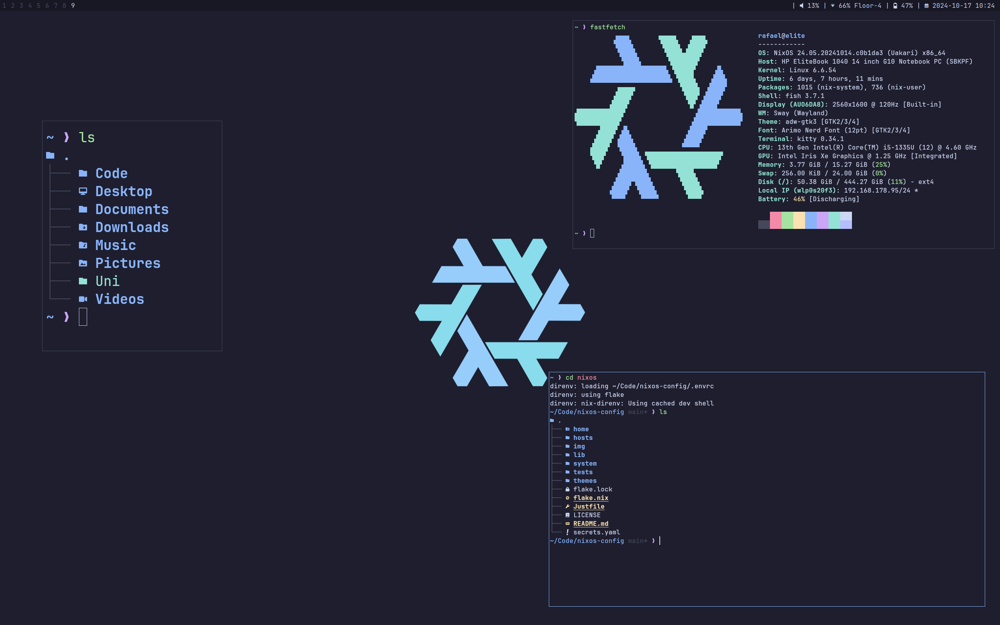

<h1 align="center">
  <picture>
    <source media="(prefers-color-scheme: dark)" srcset="https://raw.githubusercontent.com/NixOS/nixos-artwork/master/logo/nix-snowflake-white.svg">
    <source media="(prefers-color-scheme: light)" srcset="https://raw.githubusercontent.com/NixOS/nixos-artwork/master/logo/nix-snowflake-colours.svg">
    
  </picture>
  NixOS Configuration
</h1>

<p align="center">
  <a href="https://nixos.org"></a>
  <a href="https://nixos.wiki/wiki/Flakes"></a>
  <a href="https://nix-community.github.io/home-manager/"></a>
  <a href="https://github.com/YaLTeR/niri"></a>
  <a href="https://github.com/catppuccin/catppuccin"></a>
  <br>
  <a href="https://github.com/nix-community/lanzaboote"></a>
  <a href="https://en.wikipedia.org/wiki/Linux_Unified_Key_Setup"></a>
  <a href="https://www.wireguard.com"></a>
  <a href="https://github.com/Mic92/sops-nix"></a>
  <a href="https://github.com/danth/stylix"></a>
  <a href="https://github.com/actions"></a>
</p>

<p align="center">
  <b>Declarative · Reproducible · Multi-host · Self-hosted</b>
</p>

<p align="center">
  My personal NixOS configuration for laptops, desktops, and servers.
  Built with <a href="https://github.com/denful/den">den</a>, a dendritic module
  framework for NixOS flakes. Features a scrolling-tiling Wayland desktop,
  full-disk encryption, a home VPN, and system-wide 
  <a href="https://github.com/catppuccin/catppuccin">Catppuccin Mocha</a> theming.
</p>

---

## Screenshots

<p align="center">
  
</p>

> Screenshots reflect an earlier setup. WM has since migrated from Sway to
> [Niri](https://github.com/YaLTeR/niri) — updated screenshots coming soon.

---

## Features

- **[Niri](https://github.com/YaLTeR/niri)** — Scrolling-tiling Wayland compositor with infinite workspace columns, CSS-like animations, and input/focus isolation between monitors. Paired with **[Noctalia](https://github.com/noctalia-dev/noctalia)** for the desktop shell (bar, launcher, control center, notifications, wallpaper, nightlight, lockscreen).
- **[Stylix](https://github.com/danth/stylix)** + **[Catppuccin Mocha](https://github.com/catppuccin/catppuccin)** — System-wide base16 theming: every app picks up the color scheme automatically. Arimo Nerd Font for UI, JetBrainsMono Nerd Font for the terminal.
- **[den](https://github.com/denful/den) dendritic module framework** — Composable, aspect-oriented configuration. Hosts declare what they need with angle-bracket imports (`<desktop/niri>`, `<hardware/bluetooth>`). Reusable patterns via `den.batteries`. See [Architecture](#architecture) below.
- **Multi-host, single flake** — One `flake.nix` (auto-generated via [flake-file](https://github.com/vic/flake-file) + [import-tree](https://github.com/vic/import-tree)) drives 3 machines: laptop, desktop, and headless server.
- **Security** — LUKS full-disk encryption, [Lanzaboote](https://github.com/nix-community/lanzaboote) Secure Boot, [SOPS + age](https://github.com/Mic92/sops-nix) secrets decrypted via host SSH keys, DNS-level ad/tracker blocking via [StevenBlack hosts](https://github.com/StevenBlack/hosts).
- **WireGuard home VPN** — Server on the headless machine acts as a NAT gateway. Clients connect to `vpn.muijsert.org` and route internal traffic through the tunnel.
- **CI via GitHub Actions** — `nix flake check` runs on every push, validating all host and home-manager configurations.

---

## Hosts

<table>
<tr>
  <th>Host</th>
  <th>Type</th>
  <th>CPU</th>
  <th>Highlights</th>
</tr>
<tr>
  <td><code>elite</code></td>
  <td>Laptop</td>
  <td>Intel</td>
  <td>Niri + Noctalia, LUKS, Secure Boot, fingerprint, WireGuard client</td>
</tr>
<tr>
  <td><code>aorus</code></td>
  <td>Desktop</td>
  <td>AMD Ryzen</td>
  <td>Niri, Ollama, libvirtd, OBS, auto-login via greetd</td>
</tr>
<tr>
  <td><code>one</code></td>
  <td>Server</td>
  <td>Intel</td>
  <td>WireGuard server, Nginx reverse proxy, Syncthing relay</td>
</tr>
</table>

---

## Architecture

Modules are organized using the **[den](https://github.com/denful/den)** dendritic framework. The directory tree mirrors the configuration hierarchy—no manual import plumbing.

### Module layers

```
modules/
├── meta/          Build tooling, formatting, secrets, dev shell
├── base/          Universal defaults every host inherits (boot, locale, shell, editor, CLI tools)
├── system/
│   ├── audio/     PipeWire (ALSA + JACK + PulseAudio compat)
│   ├── hardware/  Bluetooth, fingerprint, Secure Boot, UPower
│   ├── hosts/     Per-machine definitions (elite, _aorus, _one)
│   ├── net/       WireGuard, DNS blocking
│   ├── stylix/    System-wide base16 theming
│   ├── sync/      Syncthing (3-way sync)
│   └── users/     Accounts, Git, GitHub, email
├── gui/
│   ├── desktop/   Full desktop compositions
│   ├── shell/     Noctalia shell
│   ├── wm/niri/   Keybinds, layout, inputs, outputs, startup
│   └── programs/  Firefox, Kitty, Thunderbird
├── cli/           Terminal music (MPD)
└── theme/         Catppuccin Mocha scheme + wallpaper
```

### How it works

`flake.nix` is auto-generated — you never edit it. The [import-tree](https://github.com/vic/import-tree) walks `modules/` and the [flake-file](https://github.com/vic/flake-file) dendritic module wires everything together.

A host definition looks like this:

```nix
# modules/system/hosts/elite/default.nix
den.hosts.x86_64-linux.elite = {
  users.rafael = { };
  theme = { scheme = ...; polarity = "dark"; wallpaper = ...; };
};

den.aspects.elite.includes = [
  <desktop/niri>       # pulls in niri + noctalia + pipewire + firefox + kitty + thunderbird
  <theme/catppuccin>   # applies the color scheme through Stylix
  <hardware/bluetooth>
  <hardware/fingerprint>
  <hardware/secureboot>
  <hardware/upower>
  <net/home-vpn>       # WireGuard client to the home server
  <sync>               # Syncthing with all other hosts
];
```

Angle brackets (`<desktop/niri>`) are resolved to module paths by `den.lib.__findFile`. The `den.ful.desktop.niri` module is a **bundle** — it groups niri, noctalia, pipewire, and all GUI apps into one importable unit. Adding a new host is just listing aspects.

---

## Getting Started

> This configuration is personal and will not run on your hardware without
> adaptation. Use it as a reference for your own NixOS setup.

### Deploying

```bash
git clone https://github.com/RafaelMuijsert/nixos-config.git
cd nixos-config

nix develop       # provides sops, age, just
sops secrets.yaml # edit encrypted secrets (requires age key)

just switch       # sudo nixos-rebuild --flake . switch
just update       # nix flake update
```

### Adding a new host

1. Create `modules/system/hosts/<name>/default.nix` with `den.hosts` and `den.aspects`
2. Add angle-bracket includes for the features you want
3. Create `hardware.nix` for disk/mount/boot configuration
4. Run `nix run .#write-flake` to regenerate the flake
5. `just switch`

---

## Inspiration

- [den](https://github.com/denful/den) — Dendritic module framework for NixOS flakes
- [Misterio77/nix-config](https://github.com/Misterio77/nix-config) — Multi-host NixOS config patterns
- [NixOS & Flakes Book](https://nixos-and-flakes.thiscute.world/) — Introductory guide
- [Catppuccin](https://github.com/catppuccin/nix) — Beautiful open-source color schemes

---

## License

[MIT](LICENSE) © Rafael Alexander Muijsert
